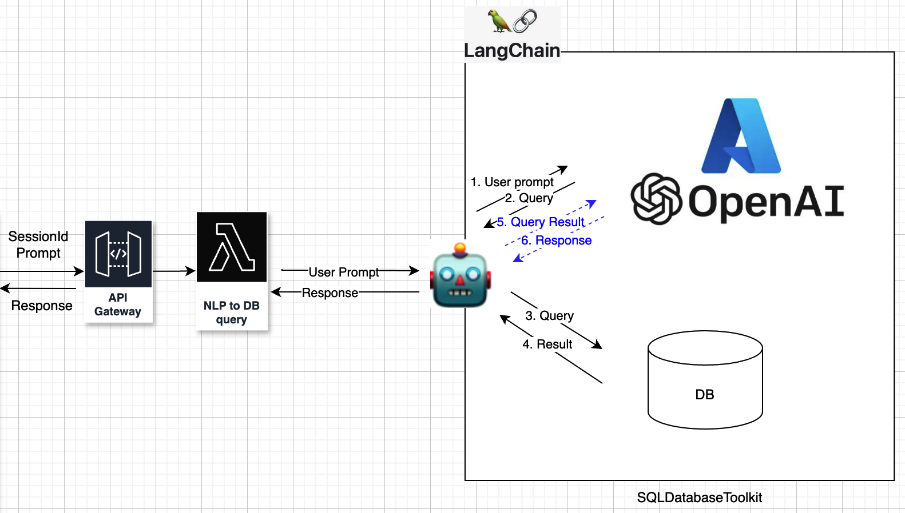

# LangChain SQL Query Agents

This project demonstrates how to use [LangChain](https://python.langchain.com/) to build agents that can process natural language queries and interact with SQL databases. The agents leverage a language model to interpret user queries, translate them into SQL statements, execute these statements against a database, and present the results.

The project includes two example scripts:

- **`quote.py`**: Connects to an SQLite database (`example.db`) containing quotes and allows users to query them using natural language.
- **`country.py`**: Uses the Chinook sample database to answer queries about music sales data, customers, and countries.

## Table of Contents

- [Prerequisites](#prerequisites)
- [Installation](#installation)
- [Usage](#usage)
  - [Running `quote.py`](#running-quotepy)
  - [Running `country.py`](#running-countrypy)
- [Examples](#examples)
  - [Example Queries for `quote.py`](#example-queries-for-quotepy)
  - [Example Queries for `country.py`](#example-queries-for-countrypy)
- [Customization](#customization)
- [Troubleshooting](#troubleshooting)
- [License](#license)
- [Acknowledgments](#acknowledgments)


### Architecture

```
+-----------+      +----------------+      +-------------------+
|  Client   | ---> |  API Gateway   | ---> |     Lambda        |
|  (Request)|      |  (REST API)    |      |   (Invoke Model)  |
+-----------+      +----------------+      +-------------------+
                                         | 
                                         v
                                  +-----------------+
                                  |   GPT           |
                                  |   Model         |
                                  +-----------------+
                                         |
                                         v
                                  +-----------------+
                                  | SQL to Snowflake|
                                  +-----------------+
                                         |
                                         v
                                  +-----------------+
                                  |   Response     |
                                  +-----------------+
```

## Prerequisites

- **Python 3.7** or higher
- An **OpenAI API key**
- Required Python packages (listed in `requirements.txt`)

```
pip3 install --upgrade --quiet  langchain-community
pip3 install --upgrade --quiet langchainhub langgraph 
pip3 install -qU langchain-openai
pip3 install snowflake-sqlalchemy

```

## Installation

1. **Clone the repository:**

   ```bash
   git clone https://github.com/yourusername/your-repo-name.git
   cd your-repo-name
   ```

2. **Create and activate a virtual environment (optional but recommended):**

   ```bash
   python -m venv venv
   source venv/bin/activate  # On Windows, use venv\Scripts\activate
   ```

3. **Install the required packages:**

   ```bash
   pip install -r requirements.txt
   ```

   The `requirements.txt` file should include:

   ```
   langchain
   langchain_openai
   langchain_community
   langgraph
   sqlalchemy
   requests
   python-dotenv
   ```

4. **Set up the environment variables:**

   Create a `.env` file in the project directory and add your OpenAI API key:

   ```env
   OPENAI_API_KEY=your-openai-api-key
   ```

## Usage

### Running `quote.py`

1. **Prepare the SQLite database:**

   - Ensure you have an `example.db` SQLite database in the project directory.
   - If you don't have one, you can create it using SQLite tools or scripts.

2. **Run the script:**

   ```bash
   python quote.py
   ```

3. **Interact with the agent:**

   - When prompted, enter your natural language query.
   - Example:

     ```
     Enter your query (or 'q' to quit): Tell me the quotes which are pending.
     ```

### Running `country.py`

1. **Run the script:**

   ```bash
   python country.py
   ```

2. **Interact with the agent:**

   - Enter your natural language query when prompted.
   - Example:

     ```
     Enter your query (or 'q' to quit): Which country's customers spent the most?
     ```

## Examples

### Example Queries for `quote.py`

- **"Tell me the quotes which are pending."**

  - Retrieves all quotes from the database with a status of pending.

- **"Show me the pending quotes that were created in February."**

  - Finds all pending quotes created in the month of February.

### Example Queries for `country.py`

- **"Which country's customers have spent the most?"**

  - Calculates the total spending per country and identifies the country with the highest total.

- **"List the top 5 countries by total sales."**

  - Generates a list of the top 5 countries based on total sales amounts.

## Customization

- **Changing the Database for `quote.py`:**

  - Replace `example.db` with your own SQLite database file.
  - Ensure the database schema matches the queries you intend to run.

- **Modifying the Language Model:**

  - Adjust the `ChatOpenAI` initialization to use a different model (e.g., `gpt-3.5-turbo` or `gpt-4`).

    ```python
    llm = ChatOpenAI(model="gpt-3.5-turbo")
    ```

- **Customizing the Prompt Template:**

  - Modify the system prompt by adjusting the `prompt_template` or creating your own prompt.

## Troubleshooting

- **Module Not Found Errors:**

  - Ensure all required packages are installed.
  - If you encounter `ModuleNotFoundError`, verify the package name and installation.

- **API Errors:**

  - Verify that your OpenAI API key is correct and has the necessary permissions.
  - Check your API usage limits and quotas.

- **Database Errors:**

  - Ensure the database files are correctly set up and accessible.
  - Verify that the tables and data exist as expected.

## License

This project is licensed under the MIT License.

## Acknowledgments

- [LangChain](https://python.langchain.com/) for providing tools to build language model applications.
- The [Chinook Database](https://github.com/lerocha/chinook-database) for the sample database used in `country.py`.